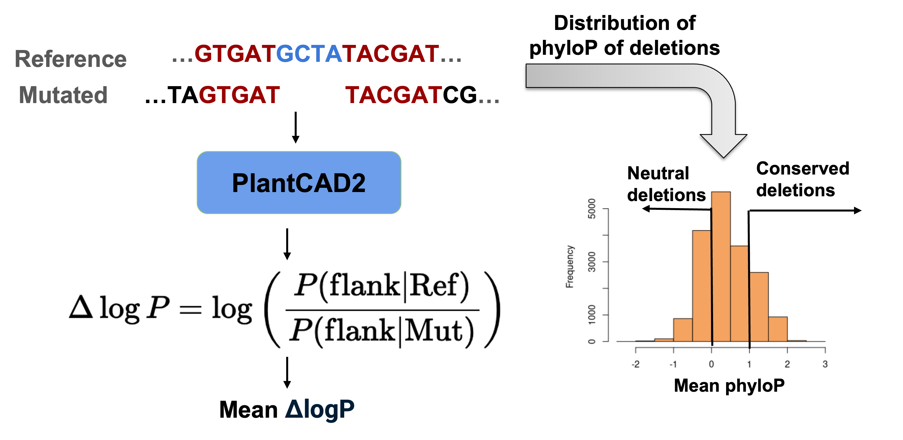
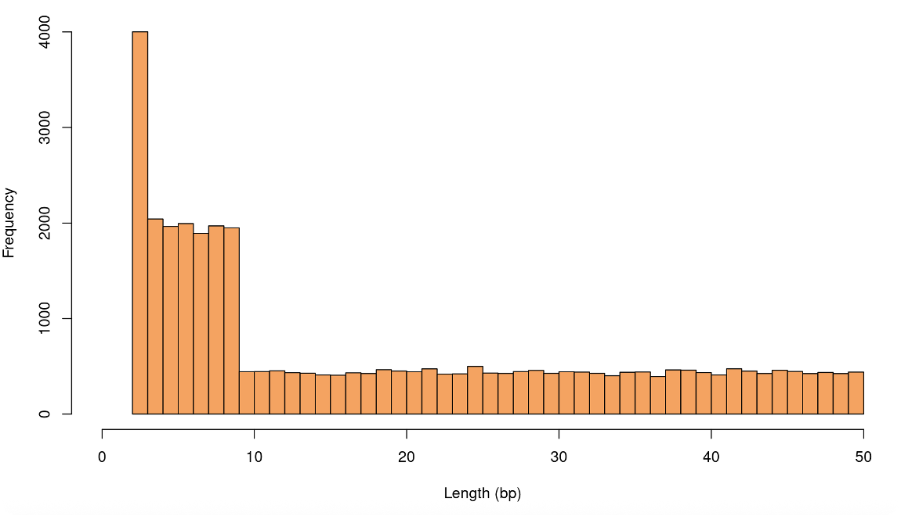

# Structural Variant Effect Analysis Pipeline

This pipeline simulates structural variants (SVs) in a genome, prepares input data for downstream analysis, and calculates masked token logits using a pre-trained PlantCAD2 model.

The core idea is to use PlantCAD2 to score each deletion by computing the change in log-likelihood (ΔlogP) of the ±N (e.g., 5, 10, 15, etc) bp flanking sequence. These flanking regions are masked and evaluated using the model, and the average ΔlogP is used to quantify how much the deletion perturbs the local sequence plausibility.

To validate this, I compared ΔlogP against the mean phyloP conservation scores of the deleted regions.


<div align="center">
    
</div>

---

## Workflow Overview

1. **Simulate Structural Variants**: Generate deletions across the genome with specified size ranges.
2. **Prepare Input Data**: Process the simulated variants to extract flanking sequences and prepare input for the model.
3. **Calculate Masked Token Logits**: Use a pre-trained PlantCAD2 model to compute logits for masked sequences.
4. **Validate with PhyloP**: Use the averaged PhyloP scores of deletions to see the correlation

---

## Step 1: Simulate Structural Variants

Simulate 40,000 deletions across the Arabidopsis genome, with deletion lengths ranging from 1 to 50 base pairs.

### Command:
```bash
genome="/local/workdir/jz963/utils/plantcad2/results/SV_effect/Arabidopsis_thaliana.TAIR10.dna.toplevel.noMtPt.fa"
python 1_Simulate_SV.py \
    --genome ${genome} \
    --num 40000 \
    --sv_type DEL \
    --size_range 1 50 \
    --output ../../results/SV_effect/Ath_Simulated_DEL_1-50_40K.vcf
```

### Output:
- A VCF file containing the simulated deletions: `Ath_Simulated_DEL_1-50_40K.vcf`.

The length distribution of the simulated deletions:
<div align="center">
    
</div>

---

## Step 2: Prepare Input Data

Process the simulated variants to extract flanking sequences and prepare input data for downstream analysis.

### Command:
```bash
python 2_Prepare_input.py input.vcf output.tsv
```

### Input:
- `input.vcf`: The VCF file generated in Step 1.

### Output:
- `output.tsv`: A TSV file containing processed variant information, including chromosome, start, end, and flanking sequences.

---

## Step 3: Calculate Masked Token Logits

Use a pre-trained PlantCAD2 model to calculate logits for masked sequences.


### Command:
```bash
python 3_getLogits.py \
    --input ${DATA_DIR}/${species} \
    --model 'kuleshov-group/compo-cad2-l24-dna-chtk-c8192-v2-b2-NpnkD-ba240000' \
    --batch_size 64 \
    --output ${DATA_DIR}/${output} \
    --device 'cuda:0' \
    --label "RefSeq"

python 3_getLogits.py \
    --input ${DATA_DIR}/${species} \
    --model 'kuleshov-group/compo-cad2-l24-dna-chtk-c8192-v2-b2-NpnkD-ba240000' \
    --batch_size 64 \
    --output ${DATA_DIR}/${output} \
    --device 'cuda:0' \
    --label "MutSeq"
```

### Input:
- Processed TSV file from Step 2.
- Pre-trained PlantCAD2 model.

### Output:
- Logits for masked sequences, saved to the specified output file.

---
