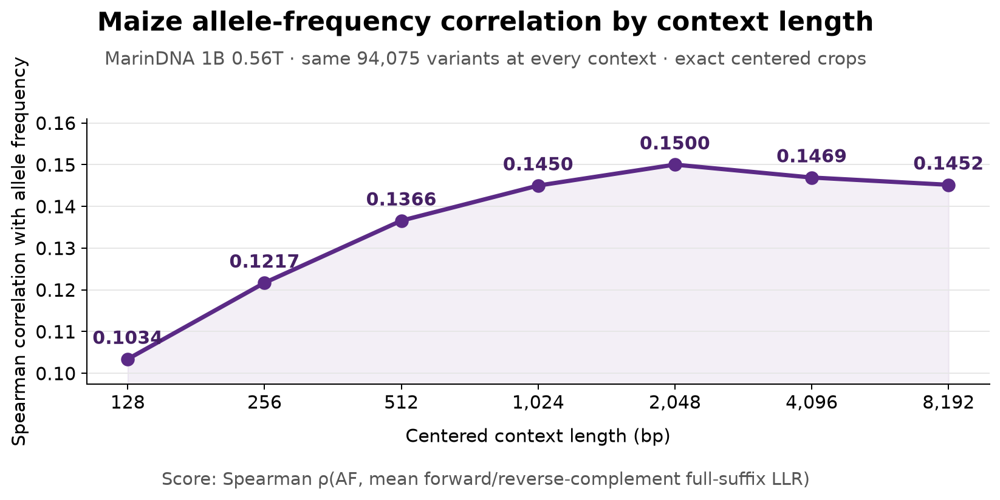

# MarinDNA 0.56T maize-AF context-length sensitivity

MarinDNA 1B 0.56T was evaluated on the fixed 94,075-variant maize allele-frequency sample at seven centered context lengths. Spearman correlation rises from 0.1034 at 128 bp to a peak of 0.1500 at 2,048 bp, then declines to 0.1469 at 4,096 bp and 0.1452 at 8,192 bp. The 2,048-bp score is 0.00484 above the independently rerun 8,192-bp baseline.

| Context (bp) | Forward / RC variant index | Spearman | Pearson | Variants/s (8×H100) | Max worker time |
| ---: | :---: | ---: | ---: | ---: | ---: |
| 128 | 64 / 63 | 0.10340 | 0.12112 | 2,209.6 | 0m43s |
| 256 | 128 / 127 | 0.12168 | 0.12505 | 962.3 | 1m38s |
| 512 | 256 / 255 | 0.13658 | 0.12973 | 656.5 | 2m23s |
| 1,024 | 512 / 511 | 0.14499 | 0.13404 | 376.2 | 4m10s |
| **2,048** | 1,024 / 1,023 | **0.15001** | **0.13711** | 186.2 | 8m25s |
| 4,096 | 2,048 / 2,047 | 0.14692 | 0.13645 | 88.7 | 17m41s |
| 8,192 | 4,096 / 4,095 | 0.14517 | 0.13696 | 40.8 | 38m26s |

## Protocol and verification

- Every context uses the identical ordered input inventory from the prior 100k-target run: 94,075 rows after the documented ambiguous-window exclusion. The input-column digest is `d894bc4963102309844577bc6e103bc04eb635d7c4c7f6c357b0e61b5d79d14b` for all seven prediction files.
- Each smaller sequence is the exact centered crop of its 8,192-bp source window. For length `L`, the zero-based variant index is `L / 2` forward and `L / 2 - 1` after reverse complementation. The runner verifies the crop, reverse complement, reference allele, and both indices before scoring.
- Shortening the window changes both the conditioning flank and the downstream suffix included in the full-sequence LLR. This is a total scored-window sensitivity test, not a prefix-only context ablation.
- Inference otherwise matches the established path: BF16 weights, profiler-verified external FlashAttention-2, FP32 A/C/G/T log-softmax and accumulation, TF32, batch 32, prefix-cache sharing, and the mean forward/reverse-complement raw LLR.
- Independent local validation recomputed every reported correlation from row-level predictions and found 94,075 finite scores, no non-ACGT scored targets, and identical row order at every context. The 8,192-bp rerun reproduces the previous Spearman score within `3.4e-9`; its maximum row-level LLR difference is `1.53e-5`.

## Execution and artifacts

Seven one-node batch jobs ran concurrently in `cw-us-east-02a`, each on one H100x8 node. All jobs succeeded without failures or preemptions, and all allocations are released.

The [immutable artifact tree](https://huggingface.co/plantcad/marindna-exp472/tree/432a84faa2cc666cb9dbdc046fe42a43a6a8f541/exp472-plantcad2-angiosperm-lr0p0005-wd0p1-train-s02-v1/results/step-535985/coreweave) contains one `plantcad2-maize-af-context-<L>-056t-100k-20260904-v1/` directory per context, including row-level predictions, metrics, input/execution manifests, and worker provenance.
