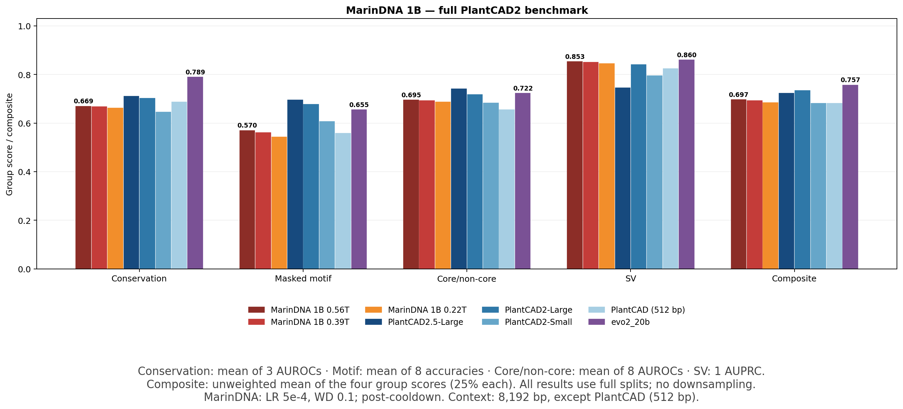
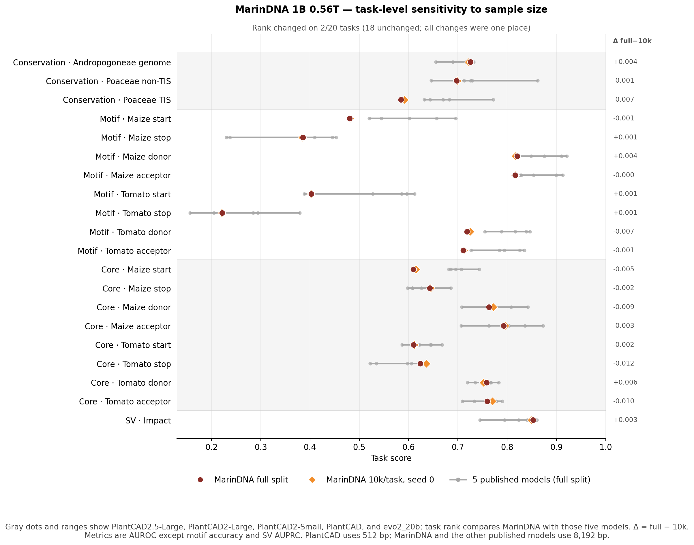

# MarinDNA 1B 0.22T / 0.39T / 0.56T — full CoreWeave evaluations

**Full splits, no downsampling:** 1,727,943 input rows across all 20 tasks, for each checkpoint. All three are post-cooldown checkpoints from the same **LR5e-4 / WD0.1** lineage. The .22T checkpoint replaces the different LR2e-4 model shown in earlier posts.



**Composite: 0.6843 → 0.6927 → 0.6966** at .22T → .39T → .56T. The .39T checkpoint improves 19/20 task rows over .22T; .56T improves 19/20 over .39T. All four group means increase at each stage. From .39T to .56T, all eight motif and all eight core/non-core rows improve; the only decline is Andropogoneae conservation (−0.0015 AUROC). The .56T Composite exceeds PlantCAD2-Small (0.6818) and PlantCAD (0.6808), but remains below the larger PlantCAD models and evo2_20b.



At the task level, the .56T full and 10k scores remain close relative to the spread across five published models. MarinDNA's rank among those six models changes on 2/20 tasks, by one place each; the mean absolute score difference is 0.0040 and the largest is 0.0120. The direct same-example check below shows that these shifts come from sample composition rather than numerical drift.

Composite gives each of the four task groups equal weight (25% each), not each of the 20 rows. Scoring is unchanged: select the larger completed forward/RC **task-level metric** for non-SV tasks; SV remains forward reference-versus-mutant. The figure uses model-family colors and annotates .56T and evo2_20b.

<details>
<summary><strong>Group scores and published-model comparison</strong></summary>

| Model | Conservation | Masked motif | Core/non-core | SV | Composite |
| :--- | ---: | ---: | ---: | ---: | ---: |
| MarinDNA 1B 0.56T | 0.6693 | 0.5696 | 0.6951 | 0.8526 | 0.6966 |
| MarinDNA 1B 0.39T | 0.6679 | 0.5613 | 0.6921 | 0.8497 | 0.6927 |
| MarinDNA 1B 0.22T | 0.6624 | 0.5428 | 0.6871 | 0.8448 | 0.6843 |
| PlantCAD2.5-Large | 0.7097 | 0.6954 | 0.7414 | 0.7450 | 0.7229 |
| PlantCAD2-Large | 0.7024 | 0.6777 | 0.7166 | 0.8410 | 0.7344 |
| PlantCAD2-Small | 0.6445 | 0.6059 | 0.6823 | 0.7946 | 0.6818 |
| PlantCAD (512 bp) | 0.6867 | 0.5577 | 0.6554 | 0.8233 | 0.6808 |
| evo2_20b | 0.7887 | 0.6552 | 0.7224 | 0.8600 | 0.7566 |

Published values use the same leaderboard snapshot (`f3c4ddb1978b78ca56fed5d40378f0aa5f19ec29`), still current when this run began. PlantCAD uses its published 512-bp context; the other models use 8,192 bp. All comparisons here use full splits.

</details>

<details>
<summary><strong>All 20 full MarinDNA results by species/task</strong></summary>

| Species / task | Rows | Metric | .22T | .39T | .56T | Δ .39T−.22T | Δ .56T−.39T |
| :--- | ---: | ---: | ---: | ---: | ---: | ---: | ---: |
| Conservation — Andropogoneae, genome-wide | 38,060 | AUROC | 0.7201 | 0.7271 | 0.7256 | +0.0070 | -0.0015 |
| Conservation — Poaceae, non-TIS CDS | 183,685 | AUROC | 0.6915 | 0.6952 | 0.6977 | +0.0036 | +0.0025 |
| Conservation — Poaceae, TIS CDS | 36,662 | AUROC | 0.5754 | 0.5814 | 0.5848 | +0.0059 | +0.0034 |
| Masked motif — Maize TIS (start) | 39,035 | Accuracy | 0.4364 | 0.4632 | 0.4805 | +0.0268 | +0.0173 |
| Masked motif — Maize TTS (stop) | 39,035 | Accuracy | 0.3504 | 0.3738 | 0.3857 | +0.0234 | +0.0119 |
| Masked motif — Maize splice donor | 153,869 | Accuracy | 0.8011 | 0.8153 | 0.8206 | +0.0142 | +0.0052 |
| Masked motif — Maize splice acceptor | 153,869 | Accuracy | 0.7920 | 0.8091 | 0.8162 | +0.0170 | +0.0071 |
| Masked motif — Tomato TIS (start) | 35,484 | Accuracy | 0.3641 | 0.3910 | 0.4027 | +0.0270 | +0.0117 |
| Masked motif — Tomato TTS (stop) | 35,483 | Accuracy | 0.2085 | 0.2178 | 0.2216 | +0.0093 | +0.0037 |
| Masked motif — Tomato splice donor | 140,456 | Accuracy | 0.7006 | 0.7141 | 0.7184 | +0.0135 | +0.0043 |
| Masked motif — Tomato splice acceptor | 140,455 | Accuracy | 0.6895 | 0.7058 | 0.7109 | +0.0163 | +0.0051 |
| Core/non-core — Maize TIS (start) | 36,409 | AUROC | 0.6040 | 0.6082 | 0.6099 | +0.0043 | +0.0017 |
| Core/non-core — Maize TTS (stop) | 36,409 | AUROC | 0.6419 | 0.6425 | 0.6431 | +0.0005 | +0.0006 |
| Core/non-core — Maize splice donor | 144,550 | AUROC | 0.7507 | 0.7599 | 0.7628 | +0.0092 | +0.0029 |
| Core/non-core — Maize splice acceptor | 144,550 | AUROC | 0.7727 | 0.7881 | 0.7928 | +0.0154 | +0.0047 |
| Core/non-core — Tomato TIS (start) | 35,478 | AUROC | 0.6068 | 0.6052 | 0.6101 | -0.0016 | +0.0048 |
| Core/non-core — Tomato TTS (stop) | 35,477 | AUROC | 0.6195 | 0.6213 | 0.6239 | +0.0018 | +0.0026 |
| Core/non-core — Tomato splice donor | 140,451 | AUROC | 0.7514 | 0.7557 | 0.7584 | +0.0043 | +0.0027 |
| Core/non-core — Tomato splice acceptor | 140,451 | AUROC | 0.7495 | 0.7560 | 0.7598 | +0.0065 | +0.0038 |
| Structural variant — Impact prediction | 18,075 | AUPRC | 0.8448 | 0.8497 | 0.8526 | +0.0048 | +0.0029 |

Deltas use unrounded values. All available rows are scored; the established ambiguous-base validity mask remains in motif-accuracy denominators. These are point scores on the complete benchmark, not statistical significance tests.

</details>

<details>
<summary><strong>Published baselines by species/task</strong></summary>

| Species / task | Metric | PlantCAD2.5-Large | PlantCAD2-Large | PlantCAD2-Small | PlantCAD (512 bp) | evo2_20b |
| :--- | ---: | ---: | ---: | ---: | ---: | ---: |
| Conservation — Andropogoneae, genome-wide | AUROC | 0.7170 | 0.7245 | 0.6555 | 0.6902 | 0.7320 |
| Conservation — Poaceae, non-TIS CDS | AUROC | 0.7290 | 0.7125 | 0.6462 | 0.7263 | 0.8620 |
| Conservation — Poaceae, TIS CDS | AUROC | 0.6830 | 0.6703 | 0.6319 | 0.6437 | 0.7720 |
| Masked motif — Maize TIS (start) | Accuracy | 0.6960 | 0.6571 | 0.5449 | 0.5204 | 0.6020 |
| Masked motif — Maize TTS (stop) | Accuracy | 0.4460 | 0.4096 | 0.2302 | 0.2373 | 0.4530 |
| Masked motif — Maize splice donor | Accuracy | 0.9210 | 0.9104 | 0.8754 | 0.8486 | 0.8220 |
| Masked motif — Maize splice acceptor | Accuracy | 0.9130 | 0.8996 | 0.8537 | 0.8289 | 0.8260 |
| Masked motif — Tomato TIS (start) | Accuracy | 0.6120 | 0.5960 | 0.5274 | 0.3885 | 0.5860 |
| Masked motif — Tomato TTS (stop) | Accuracy | 0.2940 | 0.2848 | 0.2051 | 0.1570 | 0.3790 |
| Masked motif — Tomato splice donor | Accuracy | 0.8460 | 0.8387 | 0.8165 | 0.7547 | 0.7890 |
| Masked motif — Tomato splice acceptor | Accuracy | 0.8350 | 0.8257 | 0.7940 | 0.7266 | 0.7850 |
| Core/non-core — Maize TIS (start) | AUROC | 0.7430 | 0.6960 | 0.7070 | 0.6820 | 0.6860 |
| Core/non-core — Maize TTS (stop) | AUROC | 0.6260 | 0.6080 | 0.5980 | 0.6080 | 0.6860 |
| Core/non-core — Maize splice donor | AUROC | 0.8420 | 0.8080 | 0.7640 | 0.7080 | 0.7760 |
| Core/non-core — Maize splice acceptor | AUROC | 0.8730 | 0.8360 | 0.7630 | 0.7070 | 0.8040 |
| Core/non-core — Tomato TIS (start) | AUROC | 0.6680 | 0.6460 | 0.6220 | 0.5870 | 0.6440 |
| Core/non-core — Tomato TTS (stop) | AUROC | 0.6060 | 0.5980 | 0.5350 | 0.5220 | 0.6390 |
| Core/non-core — Tomato splice donor | AUROC | 0.7830 | 0.7670 | 0.7350 | 0.7200 | 0.7660 |
| Core/non-core — Tomato splice acceptor | AUROC | 0.7900 | 0.7740 | 0.7340 | 0.7090 | 0.7780 |
| Structural variant — Impact prediction | AUPRC | 0.7450 | 0.8410 | 0.7946 | 0.8233 | 0.8600 |

</details>

<details>
<summary><strong>Forward / reverse-complement metrics</strong></summary>

| Species / task | .22T fwd | .22T RC | .39T fwd | .39T RC | .56T fwd | .56T RC |
| :--- | ---: | ---: | ---: | ---: | ---: | ---: |
| Conservation — Andropogoneae, genome-wide | 0.718714 | **0.720103** | **0.727066** | 0.719686 | 0.724321 | **0.725566** |
| Conservation — Poaceae, non-TIS CDS | 0.690293 | **0.691545** | 0.693609 | **0.695177** | 0.696709 | **0.697677** |
| Conservation — Poaceae, TIS CDS | 0.503094 | **0.575444** | 0.501283 | **0.581375** | 0.504946 | **0.584775** |
| Masked motif — Maize TIS (start) | 0.110721 | **0.436352** | 0.115358 | **0.463174** | 0.119790 | **0.480466** |
| Masked motif — Maize TTS (stop) | **0.350378** | 0.093045 | **0.373793** | 0.097989 | **0.385654** | 0.098706 |
| Masked motif — Maize splice donor | **0.801117** | 0.345716 | **0.815336** | 0.360657 | **0.820562** | 0.375092 |
| Masked motif — Maize splice acceptor | 0.356349 | **0.792044** | 0.375430 | **0.809071** | 0.395980 | **0.816162** |
| Masked motif — Tomato TIS (start) | 0.071962 | **0.364067** | 0.077741 | **0.391042** | 0.079995 | **0.402740** |
| Masked motif — Tomato TTS (stop) | **0.208513** | 0.051614 | **0.217815** | 0.055899 | **0.221564** | 0.055476 |
| Masked motif — Tomato splice donor | **0.700629** | 0.216374 | **0.714135** | 0.226535 | **0.718400** | 0.235100 |
| Masked motif — Tomato splice acceptor | 0.258738 | **0.689543** | 0.270664 | **0.705819** | 0.279948 | **0.710924** |
| Core/non-core — Maize TIS (start) | 0.349284 | **0.603970** | 0.337023 | **0.608249** | 0.347839 | **0.609922** |
| Core/non-core — Maize TTS (stop) | **0.641909** | 0.376306 | **0.642456** | 0.373992 | **0.643058** | 0.369797 |
| Core/non-core — Maize splice donor | **0.750733** | 0.546531 | **0.759917** | 0.547124 | **0.762798** | 0.546990 |
| Core/non-core — Maize splice acceptor | 0.545985 | **0.772664** | 0.549322 | **0.788087** | 0.548494 | **0.792769** |
| Core/non-core — Tomato TIS (start) | 0.446548 | **0.606849** | 0.437590 | **0.605229** | 0.439377 | **0.610063** |
| Core/non-core — Tomato TTS (stop) | **0.619477** | 0.423850 | **0.621322** | 0.415607 | **0.623898** | 0.416274 |
| Core/non-core — Tomato splice donor | **0.751381** | 0.538560 | **0.755706** | 0.534757 | **0.758436** | 0.532235 |
| Core/non-core — Tomato splice acceptor | 0.518332 | **0.749496** | 0.517045 | **0.755998** | 0.516785 | **0.759821** |
| Structural variant — Impact prediction | **0.844830** | — | **0.849663** | — | **0.852569** | — |

Bold selects the reported task score. No per-example strand maximum or averaging of chunk AUROCs/AUPRCs.

</details>

<details>
<summary><strong>Full versus previous 10,000-row previews</strong></summary>

| Same checkpoint | Sampled Composite | Full Composite | Δ full−sampled | Largest absolute task Δ |
| :--- | ---: | ---: | ---: | ---: |
| MarinDNA 1B 0.39T | 0.6934 | 0.6927 | -0.0007 | 0.0103 |
| MarinDNA 1B 0.56T | 0.6975 | 0.6966 | -0.0009 | 0.0120 |

The previous .39T/.56T numbers are precomputed on the retained seed-0 10,000-row fixtures. Full runs use all rows in original dataset order. The old .22T LR2e-4 result is deliberately excluded from this same-checkpoint comparison.

A direct overlap check matched all 200,000 retained examples to the full inputs, then compared saved predictions and metrics on those same examples (including duplicate-equivalent rows). This isolates numerical/batch-composition effects from the larger sample size:

| Same checkpoint | Different / total raw values | Max abs raw Δ | Max abs same-subset task Δ | Changed strand selections |
| :--- | ---: | ---: | ---: | ---: |
| MarinDNA 1B 0.39T | 56 / 3,830,000 | 0.000883 | 5.5e-07 | 0 |
| MarinDNA 1B 0.56T | 53 / 3,830,000 | 0.00143 | 2.03e-07 | 0 |

The tiny numerical differences are confined to five examples per checkpoint that moved from 32-row preview batches into full-split final batches of five or six rows. They change no selected strand and no task score by more than 5.5×10⁻⁷. The larger full-versus-preview shifts reflect the evaluated examples, not meaningful numerical drift. Composite changes are below 0.001 and the .56T > .39T ordering is unchanged, although individual tasks shift by up to 0.0120; this is not a general sample-size guarantee.

</details>

<details>
<summary><strong>Execution, checkpoint provenance, and verified artifacts</strong></summary>

Three jobs ran concurrently, each on **4 H100x8 nodes / 32 GPUs** in `cw-us-east-02a`, at batch priority: **12 nodes / 96 GPUs total**. All allocations were released after successful completion, with zero failures/preemptions. The three concurrent jobs finished within about 2h12 of submission, including setup and finalization.

| Model | Scoring wall time | Aggregate forwards/s | Active-worker forwards/s/GPU | Peak reserved/GPU |
| :--- | ---: | ---: | ---: | ---: |
| MarinDNA 1B 0.22T | 1:52:55 | 510.06 | 16.41 | 21.59 GiB |
| MarinDNA 1B 0.39T | 1:52:48 | 510.63 | 16.41 | 21.59 GiB |
| MarinDNA 1B 0.56T | 1:50:59 | 519.01 | 16.45 | 21.59 GiB |

Each run scores 3,455,886 sequence forwards / 28,310,618,112 tokens. These are measured scoring times, including worker input/output but excluding provisioning, input staging, and final reduction/upload; not extrapolations. BF16, external FA2, FP32 A/C/G/T softmax, no KV cache, batch32, TF32; Torch2.7.0/CUDA12.8, Transformers5.15.1, FA2 2.8.3.post1. FA2 was profiler-verified on all 96 workers.

| Model / W&B run | Final step | Post-cooldown training tokens |
| :--- | ---: | ---: |
| [MarinDNA 1B 0.22T](https://wandb.ai/eric-czech/marin/runs/exp472-plantcad2-angiosperm-lr0p0005-wd0p1-v2) | 206,144 | 216,158,699,520 |
| [MarinDNA 1B 0.39T](https://wandb.ai/eric-czech/marin/runs/exp472-plantcad2-angiosperm-lr0p0005-wd0p1-train-s01-v1) | 371,065 | 389,090,902,016 |
| [MarinDNA 1B 0.56T](https://wandb.ai/eric-czech/marin/runs/exp472-plantcad2-angiosperm-lr0p0005-wd0p1-train-s02-v1) | 535,985 | 562,022,055,936 |

Later stages resume the matching pre-cooldown checkpoints (steps164920/329840), then undergo their own cooldown. Dataset revision `d340debe0c8402c84f0696cd2002f87c2f7ba6db`; identical input hashes across all workers/checkpoints. The sampled execution path remains available for previews.

Independent CPU validation recomputed all 77 context metrics per model from saved predictions and directly extracted targets, checked every selected strand, and reproduced non-SV scores exactly from saved probabilities. Complete row coverage, chunk hashes, model hashes, and all 77 prediction arrays were verified per model.

[Machine-readable comparison](exp472-lr5e4-full-coreweave-20260831.json) · [Published leaderboard](https://huggingface.co/spaces/plantcad/plantcad2-zeroshot-leaderboard)

- MarinDNA 1B 0.22T: [checkpoint](https://huggingface.co/eczech/marindna-exp472/tree/4c71ba81544b93b8a0a0f878b44ac51d1ebb186f/exp472-plantcad2-angiosperm-lr0p0005-wd0p1-v2/hf/step-206144) · [verified full results](https://huggingface.co/eczech/marindna-exp472/tree/419caf4af3eae19587675a33869b3ce4c7d9fcb6/exp472-plantcad2-angiosperm-lr0p0005-wd0p1-v2/results/step-206144/coreweave/plantcad2-full-022t-lr5e4-n4-20260831-v1) · [independent checks](https://huggingface.co/eczech/marindna-exp472/tree/fd42c5b37674e318108c51038c7a88a968167ee6/exp472-plantcad2-angiosperm-lr0p0005-wd0p1-v2/results/step-206144/coreweave/plantcad2-full-022t-lr5e4-n4-20260831-v1/independent-validation).
- MarinDNA 1B 0.39T: [checkpoint](https://huggingface.co/eczech/marindna-exp472/tree/e56696e49dbc4c5d904507983df901fbe9d6d32d/exp472-plantcad2-angiosperm-lr0p0005-wd0p1-train-s01-v1/hf/step-371065) · [verified full results](https://huggingface.co/eczech/marindna-exp472/tree/419caf4af3eae19587675a33869b3ce4c7d9fcb6/exp472-plantcad2-angiosperm-lr0p0005-wd0p1-train-s01-v1/results/step-371065/coreweave/plantcad2-full-039t-lr5e4-n4-20260831-v1) · [independent checks](https://huggingface.co/eczech/marindna-exp472/tree/6d3b4fdd8ab73147c078e6248e8efebf027e9b91/exp472-plantcad2-angiosperm-lr0p0005-wd0p1-train-s01-v1/results/step-371065/coreweave/plantcad2-full-039t-lr5e4-n4-20260831-v1/independent-validation).
- MarinDNA 1B 0.56T: [checkpoint](https://huggingface.co/eczech/marindna-exp472/tree/2972ca5abb575ccb9878d2525aafd396e6b73d7c/exp472-plantcad2-angiosperm-lr0p0005-wd0p1-train-s02-v1/hf/step-535985) · [verified full results](https://huggingface.co/eczech/marindna-exp472/tree/d0d442e4b1c2159de92fcd6b8060753a3398d301/exp472-plantcad2-angiosperm-lr0p0005-wd0p1-train-s02-v1/results/step-535985/coreweave/plantcad2-full-056t-lr5e4-n4-20260831-v1) · [independent checks](https://huggingface.co/eczech/marindna-exp472/tree/19ee062dd0632d504aa56b5e598b45de46e2c6fe/exp472-plantcad2-angiosperm-lr0p0005-wd0p1-train-s02-v1/results/step-535985/coreweave/plantcad2-full-056t-lr5e4-n4-20260831-v1/independent-validation).

</details>

## Reproduction notes

Submitted scoring implementation: `71ddb9efd4d177b85a2e6f6d9f075c116381ee24`. Later monitoring, validation, and presentation commits did not change the frozen jobs. Shared scoring SHA-256 `320ae4ba705cd965cd3c4af5f4330576d6c60319f4bf27ba0f6046334bff6d0e`; original causal scorer SHA-256 `fb99363dd4c7c14070317f5cbf44cbf07e5862ee58506460613a1bb4477f9a4f`.

Every full run covered 1,700 contiguous, batch-aligned chunks. No rows were downsampled, shuffled, balanced, or filtered. Chunk-local metrics were disabled because some chunks contain only one class; the unchanged metric helpers were applied after complete task reconstruction. Every array, input/model hash, worker assignment, and row range was verified.

The submission example and mandatory batch-priority/ownership guards are in the [CoreWeave runbook](../coreweave/README.md). `CHECKPOINT=022t|039t|056t EVAL_MODE=full NODES=4` selects this route; `EVAL_MODE=sampled` remains the default for the retained seed-0 10,000-row previews. The isolated [Lambda route](../lambda/README.md) is unchanged.

The 0.22T export was transferred directly from CWS3 to private HF by a CPU-only Iris job; see the [checkpoint-transfer runbook](../CHECKPOINT_TRANSFER.md). No weights or CUDA/NVIDIA dependencies were staged locally. Final artifacts downloaded locally total 333,308,514 bytes; compact independent target/index/check files add only a few MB. A task-specific CPU-only NumPy/sklearn/Matplotlib cache was about 436 MB.

### Terminal Iris summaries

```text
Job: /eczech/plantcad2-full-022t-lr5e4-n4-20260831-v1 (/eczech/plantcad2-full-022t-lr5e4-n4-20260831-v1)
State: succeeded  exit=0  failures=0  preemptions=0
Tasks: 4/4 completed  succeeded=4

  TASK  STATE        EXIT  DURATION                              PEAK MEM    CUR MEM    DIAGNOSTIC
     0  succeeded       0  2 hours, 2 minutes and 57.07 seconds  -           -
     1  succeeded       0  1 hour, 54 minutes and 37.77 seconds  -           -
     2  succeeded       0  1 hour, 51 minutes and 8.25 seconds   -           -
     3  succeeded       0  1 hour, 51 minutes and 7.88 seconds   -           -
```

```text
Job: /eczech/plantcad2-full-039t-lr5e4-n4-20260831-v1 (/eczech/plantcad2-full-039t-lr5e4-n4-20260831-v1)
State: succeeded  exit=0  failures=0  preemptions=0
Tasks: 4/4 completed  succeeded=4

  TASK  STATE        EXIT  DURATION                              PEAK MEM    CUR MEM    DIAGNOSTIC
     0  succeeded       0  2 hours, 1 minute and 45.68 seconds   -           -
     1  succeeded       0  1 hour, 53 minutes and 9.33 seconds   -           -
     2  succeeded       0  1 hour, 52 minutes and 8.97 seconds   -           -
     3  succeeded       0  1 hour, 53 minutes and 48.45 seconds  -           -
```

```text
Job: /eczech/plantcad2-full-056t-lr5e4-n4-20260831-v1 (/eczech/plantcad2-full-056t-lr5e4-n4-20260831-v1)
State: succeeded  exit=0  failures=0  preemptions=0
Tasks: 4/4 completed  succeeded=4

  TASK  STATE        EXIT  DURATION                              PEAK MEM    CUR MEM    DIAGNOSTIC
     0  succeeded       0  2 hours, 9 minutes and 56.84 seconds  -           -
     1  succeeded       0  1 hour, 52 minutes and 8.61 seconds   -           -
     2  succeeded       0  1 hour, 51 minutes and 19.07 seconds  -           -
     3  succeeded       0  1 hour, 50 minutes and 51.62 seconds  -           -
```
