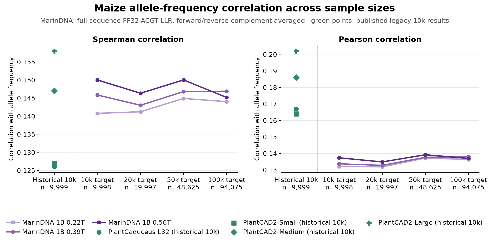

# MarinDNA primary-lineage maize allele-frequency evaluation

The three post-cooldown LR5e-4 / WD0.1 checkpoints were evaluated against the maize allele-frequency benchmark at four target sample sizes. The primary score is the direct correlation of allele frequency with `log P(ALT sequence) - log P(REF sequence)`, computed over the complete causal suffix with FP32 A/C/G/T log-softmax and accumulation, then averaged across forward and reverse-complement predictions.

The historical-size sample suggests a monotonic training trend, but the larger samples do not support a firm checkpoint ordering: 0.56T leads at the 10k, 20k, and 50k targets, while 0.39T leads at the 100k target. The largest difference between 0.39T and 0.56T at 100k is only 0.0017 correlation, but the reversal means the 10k result should be treated as a preview rather than a stable ranking.

The four target samples are independent consequence-balanced seed-42 draws rather than a nested sequence. The 50k/100k samples also exhaust the available 3,176 `grouped_start_stop` rows, so their composition is not identical to the smaller perfectly balanced samples. The green historical points are useful context, but they are published legacy-protocol scores available only for the historical 10k fixture, not exact apples-to-apples modern full-sequence evaluations.

## Correlations

| Model | 10k target Pearson | 10k target Spearman | 20k target Pearson | 20k target Spearman | 50k target Pearson | 50k target Spearman | 100k target Pearson | 100k target Spearman |
| :--- | ---: | ---: | ---: | ---: | ---: | ---: | ---: | ---: |
| MarinDNA 1B 0.22T | 0.13208 | 0.14078 | 0.13186 | 0.14122 | 0.13723 | 0.14490 | 0.13635 | 0.14401 |
| MarinDNA 1B 0.39T | 0.13369 | 0.14585 | 0.13275 | 0.14301 | 0.13764 | 0.14680 | **0.13802** | **0.14690** |
| MarinDNA 1B 0.56T | **0.13732** | **0.15000** | **0.13485** | **0.14634** | **0.13919** | **0.15001** | 0.13696 | 0.14517 |

Actual retained rows are 9,998, 19,997, 48,625, and 94,075. Bold marks the best MarinDNA checkpoint at each target size and metric.

## Historical 10k context

| Model | Context | Pearson | Spearman |
| :--- | ---: | ---: | ---: |
| PlantCaduceus_l32 | 512 | 0.167 | 0.126 |
| PlantCAD2-Small | 8,192 | 0.164 | 0.127 |
| PlantCAD2-Medium | 8,192 | 0.186 | 0.147 |
| PlantCAD2-Large | 8,192 | 0.202 | 0.158 |

The published legacy fixture contains 9,999 rows. The modern MarinDNA runs exclude `2:234358020 A>T` after reproducing that fixture exactly because its 8,192-bp reference window contains 771 non-ACGT bases that become scored causal-suffix targets on reverse complement. Therefore the MarinDNA historical-size sample contains 9,998 rows. No other row was removed.

## Protocol and verification

- Source samples are the pinned processed `plantcad/maize-allele-frequency` test split derived from the linked raw dataset. Polars 1.34.0 and seed 42 reproduce the published 10k and 20k fixtures byte-for-byte before the one documented exclusion.
- BF16 model execution, explicit external FlashAttention-2, FP32 selected-nucleotide log-softmax/accumulation, TF32, batch 32, and 8,192-bp context match the recommended Hugging Face path. A profiler trace verified the external FA2 kernel on every worker.
- Prefix caching shares only the identical causal prefix; divergent suffix passes disable cache. A 128-row smoke benchmark measured a 1.25x speedup over uncached paired forwards with identical Spearman correlation and maximum A/C/G/T LLR difference `3.04e-5`.
- A full-vocabulary FP32 sensitivity score was retained beside the primary A/C/G/T score. It changed no reported correlation by more than `2.41e-6`.
- Independent local validation recomputed all 24 primary correlations from the three uploaded `predictions.parquet` files, verified the exact memberships and row counts, and found no non-finite predictions, reference mismatches, or remaining non-ACGT scored targets.

## Execution and artifacts

The three jobs ran concurrently on two H100x8 nodes each in `cw-rno2a`: six nodes / 48 H100s total, at batch priority. Each checkpoint scored the 94,953-row union once in about 19m50 of worker inference, or about 80 variants/s per 16-GPU job including both strands; clean jobs reached terminal success in about 21m31 from submission. All allocations are released.

The 0.22T rank-0 pod was deleted after its Hugging Face upload had completed and verified, which left Iris preparing an unnecessary retry. That exact job was stopped after its artifact and all correlations were independently verified; its peer task succeeded normally. The 0.39T and 0.56T jobs completed with zero failures or preemptions.

- MarinDNA 1B 0.22T: [artifact and row-level predictions](https://huggingface.co/plantcad/marindna-exp472/tree/72f0f58ac50a91fa10ada2efe07420966e598471/exp472-plantcad2-angiosperm-lr0p0005-wd0p1-v2/results/step-206144/coreweave/plantcad2-maize-af-022t-20260904-v1)
- MarinDNA 1B 0.39T: [artifact and row-level predictions](https://huggingface.co/plantcad/marindna-exp472/tree/b4122224164b5aed158033b25d7b6068b13d3a86/exp472-plantcad2-angiosperm-lr0p0005-wd0p1-train-s01-v1/results/step-371065/coreweave/plantcad2-maize-af-039t-20260904-v1)
- MarinDNA 1B 0.56T: [artifact and row-level predictions](https://huggingface.co/plantcad/marindna-exp472/tree/ada2f34e6d6c54d3481cf040f1e92c3e943e5b72/exp472-plantcad2-angiosperm-lr0p0005-wd0p1-train-s02-v1/results/step-535985/coreweave/plantcad2-maize-af-056t-20260904-v1)

Each artifact includes exact input and execution manifests, per-worker environment/FA2 verification, raw chunks, merged row-level predictions, metrics, and provenance. The public checkpoint repository is the durable prediction store; only compact copies were used for local independent validation.
