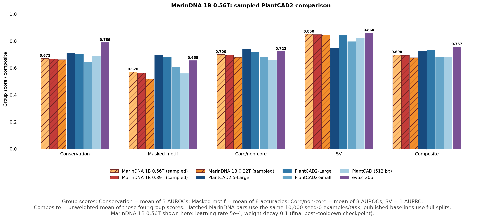

# MarinDNA 1B 0.56T — paired stage-s02 checkpoint evaluation

Both final post-cooldown stage-s02 checkpoints were evaluated on the same Lambda 2×H100 rental, using the exact 20 retained seed-0 fixtures of 10,000 examples each. These are sampled estimates, not leaderboard submissions. No scoring or sampling logic changed from the previous final-checkpoint runs.

The figure omits the 0.56T LR1e-4/WD0.2 checkpoint for readability; its scores remain in the tables. Bar labels show the 0.56T LR5e-4/WD0.1 and evo2_20b scores.

The LR5e-4/WD0.1 checkpoint has the highest MarinDNA Composite in this comparison: **0.6975**, versus **0.6934** for the previous 0.39T checkpoint and **0.6926** for LR1e-4/WD0.2. It improves 18/20 paired task rows, all eight motif rows, and all four group means relative to 0.39T. The two declines are only 0.000155 (Poaceae non-TIS conservation) and 0.000088 (tomato core/non-core donor). LR1e-4/WD0.2 improves 9/20 rows and remains almost flat overall: its conservation/SV gains offset tomato motif and maize splice core/non-core declines. It still leads the other 0.56T checkpoint in conservation and SV. Small differences are point estimates, not established statistical significance.

## Group scores

| Model | Conservation | Masked motif | Core/non-core | SV | Composite |
| :--- | ---: | ---: | ---: | ---: | ---: |
| MarinDNA 1B 0.56T (LR 1e-4, WD 0.2) | 0.673 | 0.555 | 0.690 | 0.853 | 0.6926 |
| MarinDNA 1B 0.56T (LR 5e-4, WD 0.1) | 0.671 | 0.570 | 0.700 | 0.850 | 0.6975 |
| MarinDNA 1B 0.39T | 0.669 | 0.561 | 0.696 | 0.848 | 0.6934 |
| MarinDNA 1B 0.22T | 0.661 | 0.518 | 0.678 | 0.847 | 0.6762 |
| PlantCAD2.5-Large | 0.710 | 0.695 | 0.741 | 0.745 | 0.7229 |
| PlantCAD2-Large | 0.702 | 0.678 | 0.717 | 0.841 | 0.7344 |
| PlantCAD2-Small | 0.645 | 0.606 | 0.682 | 0.795 | 0.6818 |
| PlantCAD (512 bp) | 0.687 | 0.558 | 0.655 | 0.823 | 0.6808 |
| evo2_20b | 0.789 | 0.655 | 0.722 | 0.860 | 0.7566 |

Composite is the unweighted mean of four group scores, 25% each: means of 3 conservation AUROCs, 8 motif accuracies, 8 core/non-core AUROCs, and 1 SV AUPRC. It is not the mean of 20 rows. Published results use full splits at leaderboard revision `f3c4ddb1978b78ca56fed5d40378f0aa5f19ec29`; MarinDNA uses identical sampled rows. PlantCAD uses its published 512-bp context; the other models use 8,192 bp. Published-versus-sampled comparisons are directional.

## Token labels and checkpoint lineage

| Display label | Run suffix | Final step | Final W&B total tokens |
| :--- | :--- | ---: | ---: |
| MarinDNA 1B 0.22T | `lr0p0002-wd0p1-v2` | 206144 | 216,158,699,520 |
| MarinDNA 1B 0.39T | `lr0p0005-wd0p1-train-s01-v1` | 371065 | 389,090,902,016 |
| MarinDNA 1B 0.56T (LR 1e-4, WD 0.2) | `lr0p0001-wd0p2-train-s02-v1` | 535985 | 562,022,055,936 |
| MarinDNA 1B 0.56T (LR 5e-4, WD 0.1) | `lr0p0005-wd0p1-train-s02-v1` | 535985 | 562,022,055,936 |

All run IDs begin `exp472-plantcad2-angiosperm-`; W&B project is `eric-czech/marin`. Totals were checked directly against W&B and `(global_step + 1) × 128 × 8192` from the experiment code. The previous 10E/20E display labels are now 0.22T/0.39T. Both s02 runs resume their matching s01 pre-cooldown `step-329840`, not the evaluated s01 final `step-371065`. These are different LR/WD lineages, not an isolated test of learning rate or additional tokens. Final validation losses were 0.9647321701 (LR1e-4) and 0.9654271603 (LR5e-4); the slightly lower loss did not select the stronger sampled Composite.

## Execution and verification

- Evaluation code: `63cdd9b77baaec987f2733af8ab4ff54b8a777cc`; only plotting/reporting and transfer notes changed afterward.
- Qwen3, 973,178,880 parameters, vocabulary size 7, context 8,192 bp. BF16, external FlashAttention-2, FP32 A/C/G/T softmax, no KV cache, batch32, TF32 enabled.
- Torch2.7.0/CUDA12.8, Transformers5.15.1, flash-attn2.8.3.post1, NumPy1.26.4, sklearn1.5.2. Both new environment records exactly match the previous 0.39T environment.
- All four new workers profiler-verified `flash_attn::_flash_attn_forward` and `flash::flash_fwd_kernel`. Each run has 20 tasks ×10,000 input rows, 400,000 forwards, 3,276,800,000 scored tokens, and finite selected metrics.
- All 20 TSV SHA-256 hashes match the retained fixtures at HF revision `2090e4c6c52393b5b8626ea9be70205c79935d53`; dataset revision `d340debe0c8402c84f0696cd2002f87c2f7ba6db`. Manifest SHA-256: `6549414b71fe76e8d1f5e0f10b0559a07b35e064607fae0de20b81fc9dfc1345`.
- Non-SV rows still select the larger completed forward or reverse-complement task-level metric, never a per-example maximum. SV is forward reference-versus-mutant. Relative to 0.39T, both new models flip Andropogoneae to RC; only LR1e-4 also flips Poaceae non-TIS to RC. Other selected orientations are unchanged.

| Model | 2×H100 wall time | Aggregate forwards/s | Peak reserved/GPU | Full-split estimate, 2×H100 |
| :--- | ---: | ---: | ---: | ---: |
| MarinDNA 1B 0.56T (LR 1e-4, WD 0.2) | 3:21:52 | 33.02 | 21.59 GiB | 29.05 h |
| MarinDNA 1B 0.56T (LR 5e-4, WD 0.1) | 3:21:43 | 33.05 | 21.59 GiB | 29.02 h |

Full-split estimates cover 1,727,943 rows and assume balanced two-GPU utilization; they are extrapolations, not full runs. The two new evaluations used 6:43:35 of evaluation wall time in total.

## Artifacts and transfer provenance

Both exports came from `s3://marin-us-east-02a/MarinDNA/exp472_plantcad2_baseline/checkpoints/<run-id>/2026.08.28/hf/step-535985`. Each contained 4 files / 3,892,739,156 bytes. CPU-only Iris transfers took 33.72 seconds for LR1e-4 and 27.34 seconds for LR5e-4, with exact file/byte verification and automatic staging cleanup. No model weights passed through the laptop or development VM; see [the transfer runbook](../CHECKPOINT_TRANSFER.md).

- LR1e-4/WD0.2: [checkpoint](https://huggingface.co/plantcad/marindna-exp472/tree/dcc95e936a05322c6312589670bf21944cd7ea65/exp472-plantcad2-angiosperm-lr0p0001-wd0p2-train-s02-v1/hf/step-535985) · [verified results](https://huggingface.co/plantcad/marindna-exp472/tree/cfa441fa4cd7198d6d5af57ff5df69bd7a9fff56/exp472-plantcad2-angiosperm-lr0p0001-wd0p2-train-s02-v1/results/step-535985/leaderboard-seed0-n10000): 47 files / 1,735,013,674 bytes.
- LR5e-4/WD0.1: [checkpoint](https://huggingface.co/plantcad/marindna-exp472/tree/2972ca5abb575ccb9878d2525aafd396e6b73d7c/exp472-plantcad2-angiosperm-lr0p0005-wd0p1-train-s02-v1/hf/step-535985) · [verified results](https://huggingface.co/plantcad/marindna-exp472/tree/dfd4d41f0fc70f95cc22081de28a1546412f1bdc/exp472-plantcad2-angiosperm-lr0p0005-wd0p1-train-s02-v1/results/step-535985/leaderboard-seed0-n10000): 44 files / 1,734,988,236 bytes.

Both artifact trees contain the sampled fixtures, manifest, raw scores, task/strand tables, comparison figure, published baseline CSV, token counters, and provenance. Small result trees are also retained locally. Lambda instance `91964762e12a4bc68ecd9abc72be5418` was terminated after both uploads were verified; see [Lambda notes](../LAMBDA.md).
